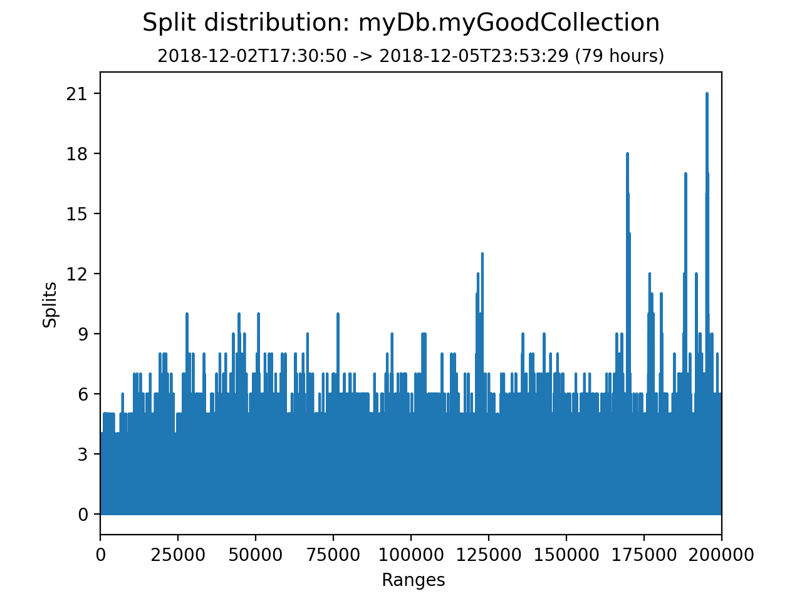
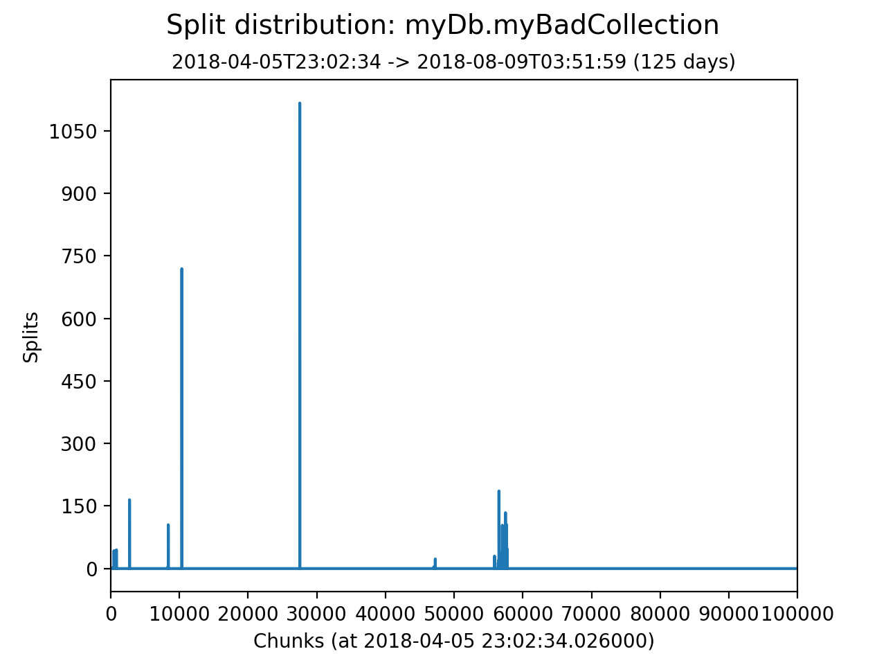

# mongo-shardkey-tools

Visualise and inspect the performance and scalability of a MongoDB shard key.

plot_split_distribution
-------------------------

Visualise the [frequency](https://docs.mongodb.com/manual/core/sharding-shard-key/#shard-key-frequency)
of a shard key and whether the key is [monotonically changing](https://docs.mongodb.com/manual/core/sharding-shard-key/#monotonically-changing-shard-keys).
Both aspects affect write scalability and data distribution.

### Sample Output

The left hand plot displays even split distribution;
the plot on the right hand side displays poor distribution.

Even distribution             | Uneven distribution
:-------------------------:|:-------------------------:
|  

The distribution covers a time window. The left-hand example covers 79 hours, the right-hand 125 days. The start time of the window defaults to the earliest time available and is configurable.

* The X axis is a list of continguous ranges of shard key values, sorted from minKey (leftmost range) to maxKey (rightmost range). These ranges are derived from the chunk definition at the earliest time available and they do not map to _current_ chunks.
* The Y axis displays the chunk splits that occurred within a range.


Clicking a range displays its boundaries and the number of splits it underwent. The below shows three splits in the shard key range "aa" (inclusive) to "az" (exclusive).
```
range[7851]: {"min": {"shardkey": "aa"}, "max": {"shardkey": "az"}, "splits": 3}
```

### Getting Started

1. Download this repository.
2. Install dependencies.
   ```
   pip install matplotlib numpy progressbar pymongo

   ```
3. Launch the tool.
  ```
  $ python plot_split_distribution.py -u 'URI' mydb.mycoll
  ```
  Replace `mydb.mycoll` with the collection [namespace](https://docs.mongodb.com/manual/reference/glossary/#term-namespace), and `URI` with the [connection string](https://docs.mongodb.com/manual/reference/connection-string/) to a mongos node.

It is also possible to explore the tool with the sample `db.coll` included in `sample_config.gz`.
```
$ mlaunch init --single
$ mongorestore --gzip --archive=sample_data/sample_config.gz
$ python plot_split_distribution.py db.coll
```

### Caveats

The following aspects may affect or skew the split distribution. Depending on the frequency of these events,
the resulting distribution may not accurately reflect actual write activity.
* The [balancer](https://docs.mongodb.com/manual/tutorial/manage-sharded-cluster-balancer/) can perform splits during a migration.
* A [range that is not divisible](https://docs.mongodb.com/manual/core/sharding-data-partitioning/#indivisible-chunks) cannot be split. The plot will show no activity for an indivisible range even if the range is subject to writes.
* If manual splitting is performed, that split activity will likely be unrelated to write activity.

For more accurate results, ensure that the ranges are divisible and that the balancer is disabled during the time of interest.

Disclaimer
----------

This software is not supported by [MongoDB, Inc.](https://www.mongodb.com>)
under any of their commercial support subscriptions or otherwise. Any usage of
mongo-shardkey-tools is at your own risk. Bug reports, feature requests and
questions can be posted in the [Issues](https://github.com/josefahmad/mongo-shardkey-tools/issues?state=open>)
section on GitHub.
